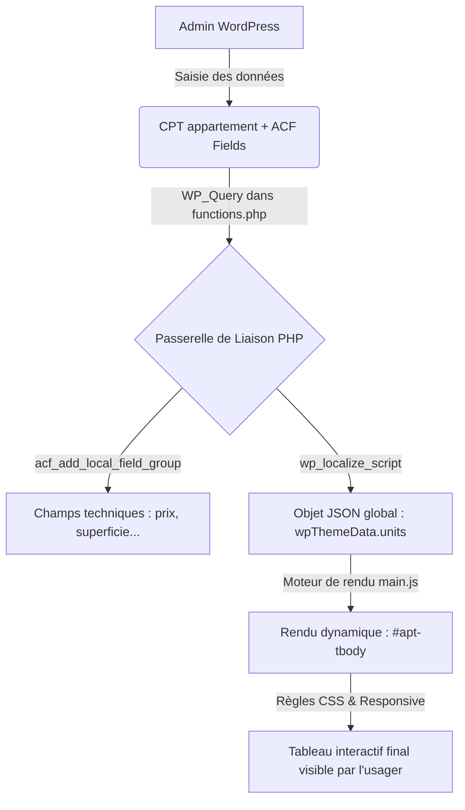

# Intégration et Gestion avec ACF du Tableau des Appartements (WordPress)

Ce guide technique détaille l'intégration complète et le cycle de vie du **tableau des appartements**, depuis la saisie des données dans l'administration WordPress via **ACF (Advanced Custom Fields)** jusqu'au rendu dynamique et interactif côté client.

---

## 1. Architecture Globale (Liaison Back-end / Front-end)

Le système de location repose sur un modèle hybride :
1.  **Back-end (WordPress)** : Les administrateurs saisissent les caractéristiques des appartements via des formulaires d'édition structurés.
2.  **Passerelle (PHP/JSON)** : WordPress interroge la base de données, extrait les champs personnalisés ACF, les assainit (sanitization) et les injecte dans le script front-end sous forme d'un objet JSON global.
3.  **Front-end (JS/CSS)** : Le script client ([main.js](file:///Volumes/crucial/Shortkut/LesImmeublesQC_html/main.js)) intercepte ces données, gère le tri interactif à la volée, masque ou affiche les prix selon les politiques de confidentialité, et effectue le rendu DOM au sein du squelette HTML.



---

## 2. Structure des données ACF (Advanced Custom Fields)

Un groupe de champs personnalisés nommé **"Détails de l'appartement"** (`group_details_appartement`) est déclaré programmatiquement dans [functions.php](file:///Applications/MAMP/htdocs/LesImmeublesQC/wp-content/themes/les-immeubles-qc/functions.php). Ces champs sont automatiquement rattachés au Custom Post Type **Appartement** (`appartement`).

### Liste des champs de saisie :

| Étiquette du champ | Nom technique (slug) | Type ACF | Règles et Choix |
| :--- | :--- | :--- | :--- |
| **Prix par mois ($)** | `prix` | Nombre (`number`) | Loyer mensuel brut en CAD (requis, min: 0). |
| **Superficie (pi²)** | `superficie` | Nombre (`number`) | Surface de l'unité (requis, min: 0). |
| **Nombre de chambres** | `chambres` | Sélecteur (`select`) | Choix : `1 chambre`, `2 chambres`, `3 chambres`, `Studio` (requis). |
| **Salles de bain** | `salles_de_bain` | Nombre (`number`) | Nombre de salles d'eau (défaut: 1). |
| **Statut** | `statut` | Sélecteur (`select`) | Choix : `Disponible`, `Occupé`, `Réservé` (requis). |
| **Date d'occupation** | `occupation` | Texte (`text`) | Date de disponibilité (ex: "Immédiate", "1er Juillet"). |
| **Photo 1 (Image principale)** | `photo_1` | Image (`image`) | URL de l'image de couverture. |
| **Photos 2 à 5** | `photo_2` à `photo_5` | Image (`image`) | URLs secondaires pour le carrousel. |

---

## 3. La Passerelle de Liaison (Querying & Serialization)

C'est dans le fichier [functions.php](file:///Applications/MAMP/htdocs/LesImmeublesQC/wp-content/themes/les-immeubles-qc/functions.php) que s'effectue la liaison de données. Lors de l'initialisation du thème, une requête personnalisée (`WP_Query`) extrait tous les appartements publiés et sérialise leurs métadonnées ACF :

```php
// Dynamic Query to fetch all apartments from database
$apt_query = new WP_Query(array(
    'post_type'      => 'appartement',
    'posts_per_page' => -1,
    'post_status'    => 'publish',
    'orderby'        => 'title',
    'order'          => 'ASC'
));

$js_units = array();
if ($apt_query->have_posts()) {
    while ($apt_query->have_posts()) {
        $apt_query->the_post();
        $post_id = get_the_ID();
        
        // Extraction des valeurs ACF
        $prix           = get_field('prix', $post_id);
        $superficie     = get_field('superficie', $post_id);
        $chambres       = get_field('chambres', $post_id);
        $salles_de_bain = get_field('salles_de_bain', $post_id);
        $statut         = get_field('statut', $post_id);
        $occupation     = get_field('occupation', $post_id);

        // Assainissement des données et valeurs de repli (Sanitization)
        $prix           = $prix ? intval($prix) : 0;
        $superficie     = $superficie ? intval($superficie) : 0;
        $chambres       = $chambres ? sanitize_text_field($chambres) : '1 chambre';
        $salles_de_bain = $salles_de_bain ? intval($salles_de_bain) : 1;
        $statut         = $statut ? sanitize_text_field($statut) : 'Disponible';
        $occupation     = $occupation ? sanitize_text_field($occupation) : '—';

        // Construction du tableau associatif pour le front-end
        $js_units[] = array(
            'unite'        => get_the_title(),
            'superficie'   => $superficie,
            'chambres'     => $chambres,
            'sallesDeBain' => $salles_de_bain,
            'prix'         => $prix,
            'occupation'   => $occupation,
            'statut'       => $statut,
            'permalink'    => get_permalink()
        );
    }
    wp_reset_postdata();
}

// Injection des données dans le script front-end
wp_localize_script('les-immeubles-qc-main', 'wpThemeData', array(
    // ... autres URLs ...
    'units' => $js_units,
));
```

---

## 4. Moteur de Rendu Interactif Front-end

Côté client, le script [main.js](file:///Volumes/crucial/Shortkut/LesImmeublesQC_html/main.js) intercepte la variable `wpThemeData.units`. La fonction `renderTable()` s'occupe de trier et d'afficher les éléments au sein de l'élément cible `#apt-tbody` en respectant deux politiques métier majeures :

### 4.1 Priorité Absolue aux Logements Disponibles
Les appartements portant le statut `"Disponible"` apparaissent **systématiquement en premier**, peu importe la colonne de tri choisie par le visiteur.

```javascript
let data = [...wpThemeData.units].sort((a, b) => {
  // Tri prioritaire par statut "Disponible"
  const dispo = (x) => x.statut === 'Disponible' ? 0 : 1;
  if (dispo(a) !== dispo(b)) return dispo(a) - dispo(b);
  
  // Tri secondaire cliquable (ex. Prix, Superficie)
  const av = a[sortKey], bv = b[sortKey];
  if (typeof av === 'string') return sortDir === 'asc' ? av.localeCompare(bv, 'fr') : bv.localeCompare(av, 'fr');
  return sortDir === 'asc' ? av - bv : bv - av;
});
```

### 4.2 Confidentialité des Loyer (Masquage Conditionnel)
Pour préserver la confidentialité des baux en cours de vos locataires actuels, le loyer n'est affiché **que pour les logements disponibles**. Les logements occupés ou réservés affichent un tiret neutre (`—`).

```javascript
let priceText = '—';
if (u.statut === 'Disponible') {
  const formattedPrice = u.prix.toLocaleString('fr-CA');
  priceText = isMobile ? `${formattedPrice} $` : `${formattedPrice} $/mois`;
}
```

---

## 5. Rendu Visuel et Squelette de Synchronisation (DOM)

Afin d'assurer une fidélité visuelle absolue entre la maquette statique HTML et le site WordPress dynamique, la structure de la table est rigoureusement identique dans :
*   Le fichier HTML statique [location-appartements-etudiants-montreal.html](file:///Volumes/crucial/Shortkut/LesImmeublesQC_html/location-appartements-etudiants-montreal.html).
*   Le template de page WordPress [page-location-appartements-etudiants-montreal.php](file:///Applications/MAMP/htdocs/LesImmeublesQC/wp-content/themes/les-immeubles-qc/page-location-appartements-etudiants-montreal.php).

### Squelette HTML du tableau :
```html
<div class="table-wrap">
  <div class="table-count" id="table-count"></div> <!-- Compteur de résultats dynamique -->
  <div class="table-scroll">
    <table>
      <thead>
        <tr>
          <th onclick="sortTable('unite')" id="th-unite">Unité <svg ...></svg></th>
          <th onclick="sortTable('superficie')" id="th-superficie">Superficie <svg ...></svg></th>
          <th onclick="sortTable('chambres')" id="th-chambres">Chambres <svg ...></svg></th>
          <th onclick="sortTable('prix')" id="th-prix">Prix <svg ...></svg></th>
          <th onclick="sortTable('statut')" id="th-statut">Statut <svg ...></svg></th>
        </tr>
      </thead>
      <tbody id="apt-tbody">
        <!-- Rendu dynamique par main.js -->
      </tbody>
    </table>
  </div>
</div>
```

---

## 6. Intégration Responsive & Styles CSS

*   **Adaptation mobile (`overflow-x: auto`)** : Sur écrans tactiles, pour éviter que le tableau se comprime de façon illisible, la classe `.table-scroll` permet un défilement horizontal fluide et natif.
*   **Affichage des prix mobile** : Sur les téléphones, le suffixe `$/mois` est tronqué au format compact `${formattedPrice} $` pour maximiser la clarté.
*   **Classes de badges de statut** : Les styles sont définis dans les fichiers [style.css](file:///Volumes/crucial/Shortkut/LesImmeublesQC_html/style.css) avec un code couleur doux et élégant :
    *   `.statut-dispo` (Teinte vert forêt douce) : Disponible.
    *   `.statut-occupe` / `.statut-reserve` (Teinte gris neutre) : Occupé / Réservé.
